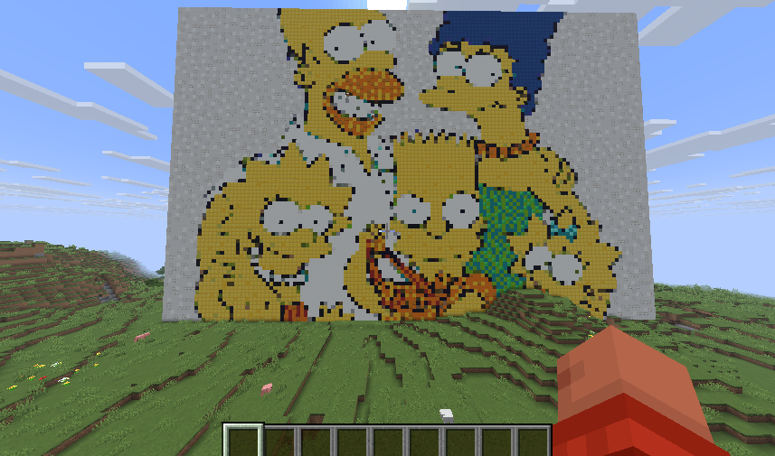
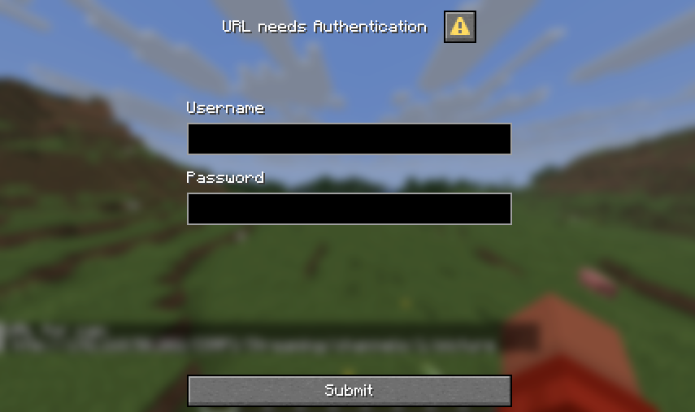

## Table of Contents
<!-- TOC -->
* [Table of Contents](#table-of-contents)
    * [Copycat](#copycat)
    * [Command Tree](#command-tree)
    * [Features](#features)
    * [Experimental](#experimental)
    * [Possibly Upcoming](#possibly-upcoming)
    * [How It Works](#how-it-works)
    * [Version History](#version-history)
<!-- TOC -->

# Copycat

A Minecraft plugin that converts images from URLs into pixel art using in-game blocks. HTTP Redirects and basic auth are supported. 
Video is rendered using VLC when available.






## Command Tree
```
/cc
├── admin
│   ├── undo <player>               # Admin undo for specific player
│   └── purgeAllUndoBuffers         # Purge all undo buffers for all players to free memory
├── list                            # List all saved image shortcuts
├── add <name> <url>                # Add new url shortcut for video or image
├── remove <name>                   # Remove image shortcut (with tab completion)
├── copy <shortcut>                 # Render image or stream video from shortcut (with tab completion)
├── undo                            # Undo last action for current player
├── stop                            # Stop all active video streams for current player
└── set
    ├── dithering <true|false>      # Enable/disable image dithering
    ├── dimensions <width> <height> # Set render dimensions
    └── profile <profileName>       # Set block profile (with tab completion)
```

## Permissions

| Permission | Description | Default |
|------------|-------------|---------|
| `copycat.*` | Allows access to all Copycat features | `op` |
| `copycat.admin` | Allows access to administrative commands | `op` |
| `copycat.user` | Allows access to basic Copycat commands | `true` |
| `copycat.command.list` | Allows using `/cc list` | `true` |
| `copycat.command.add` | Allows using `/cc add` | `true` |
| `copycat.command.remove` | Allows using `/cc remove` | `true` |
| `copycat.command.copy` | Allows using `/cc copy` | `true` |
| `copycat.command.undo` | Allows using `/cc undo` | `true` |
| `copycat.command.stop` | Allows using `/cc stop` | `true` |
| `copycat.command.set` | Allows using `/cc set` | `true` |

## Features
- **Brigadier Command System**: The command system has been updated to support the new brigadier system and provide tab completion
- **Image-to-Block Conversion**: Downloads images from URLs and converts them into Minecraft block structures
- **Video Streaming**: Supports streaming video (including MJPEG) directly onto blocks using VLCJ
- **Color Mapping**: Preprocesses Minecraft block textures to create color averages for accurate material matching
- **Image Processing**: Automatically resizes and dithers images to optimize them for pixel art conversion
- **Per-Pixel Analysis**: Maps each pixel to the closest matching Minecraft block based on color similarity
- **Basic Auth**: Support for HTTPS basic auth is included
- **Permissions**: Robust permission system for fine-grained access control

## Possibly Upcoming
- **Persistent Undo Buffers**: Right now, they are in memory only and lost after server restart 
- **Persistent Polling/Streaming**: To keep streaming those streams across restarts
- **Dynamic Color Mapping**: to set a default color map with the server's loaded resource pack.

## How It Works

1. Enter an image or video URL in-game
2. The plugin downloads and resizes the image to your specified resolution
3. Each pixel is analyzed and mapped to the closest matching Minecraft block color
4. The plugin places the corresponding blocks to recreate the image as pixel art
5. For video, VLCJ is used. VLC must be installed on the host OS for video support.
7. Video playback will only stay active while a player is logged in. This was a design decision in order to minimize load on the server. 

**Note**: Results are optimized for the default Minecraft textures. Using other texture packs may produce suboptimal color matching.

## Version History

This plugin was originally created for Bukkit 1.4.7 and has been recently updated to work with modern PaperMC versions (1.21+).

For historical information about the original plugin, see: https://bukkit.org/threads/edit-copycat-v1-0-render-images-from-a-url-1-4-6-r0-4.12730/

